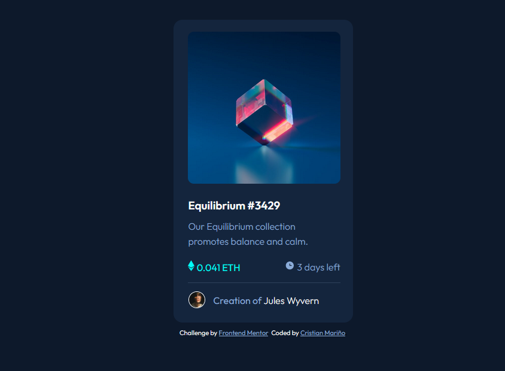
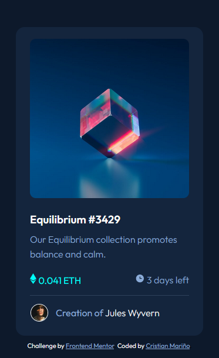

# Frontend Mentor - NFT preview card component solution

This is a solution to the [NFT preview card component challenge on Frontend Mentor](https://www.frontendmentor.io/challenges/nft-preview-card-component-SbdUL_w0U). Frontend Mentor challenges help you improve your coding skills by building realistic projects. 

## Table of contents

- [Overview](#overview)
  - [The challenge](#the-challenge)
  - [Screenshot](#screenshot)
  - [Links](#links)
- [My process](#my-process)
  - [Built with](#built-with)
- [Author](#author)

## Overview

### The challenge

Users should be able to:

- View the optimal layout depending on their device's screen size
- See hover states for interactive elements

### Screenshot

### Links

- Solution URL: [Vercel](https://nft-preview-card-component-tan.vercel.app/)
- Live Site URL: [Vercel](https://nft-preview-card-component-tan.vercel.app/)

## My process

### Built with

- Semantic HTML5 markup
- Flexbox

## Author

- Website - [My linkedin](https://www.linkedin.com/in/cristian-emanuel-mari%C3%B1o96/)
- Frontend Mentor - [@cristianemm96](https://www.frontendmentor.io/profile/cristianemm96)
- Instagram - [@crist_i_an](https://www.instagram.com/crist_i_an)

